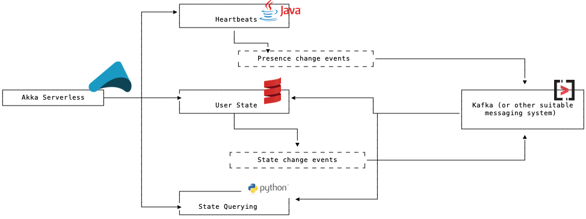

Thankfully, Turkey Day this year was a success, with time well spent with family and lots of drink and delicious food, although I was not able to convince my sister, responsible for food prep this year, to use my Thanksgiving Turkey of a post (hey!) in her cooking process. On this year's Thanksgiving Day, knowing that I had a day full of eating and drinking ahead of me, I took part in an annual tradition of mine: the Peloton Turkey Burn. A great way to burn calories but also to reflect on what it means to be real-time, within the context of a virtual social event with 10s of 1000s of users joining, sharing data and other wise participating in a shared experience. What technology enables this? How should it all work to yield the best experience? And when can I start eating? All questions that flowed through my mind during this year's event.

---
**NOTE**

If you want to skip to code, go [[Add Scalable Real-time Presence with Akka Serverless, Scala and Kafka#Presence Requirements|here]]. Also, you can view and then clone the entire project containing the three services, created as part of the article, [here](https://github.com/jpollock/akka-serverless-presence-application) (`git clone git@github.com:jpollock/akka-serverless-presence-application.git` in a directory on your machine, if you want to cut to the chase!).

---

Each year, tens of thousands of eager-to-burn-calories-in-advance-of-massive-food-intake riders hop on to their Pelotons and jointly, live, take part in a special ride, mostly in the comfort of their homes and apartments. Normally, and you can see this anecdotally just by participating in their live rides, you might find tens to hundreds of riders taking part in these real-time, live events. Scaling architectures and infrastructure to support these ups and downs - same solution for the live rides with tens of riders as for the Turkey Burns and other major events Peloton hosts throughout the year - is tough. With Peloton, of course the main feature is the live feed; I can't ride the bike if I don't have that instructor telling me what to do! But much of the success of their platform is based on the social features in the bike's application: from giving high-fives to fellow riders, to tracking position in the race - ahem, I mean 'ride' - to enabling one to filter out those pesky young riders so that this 50+ male from SF can feel good about his relative place in the world, the Peloton experience relies heavily on the idea of "presence": who is on-line, what are they all about, i.e. their profile, and what's happening relative to them, in the context of the event, in the case of Peloton. This is not much different from the presence of chat applications, on-line social events and even platforms like LinkedIn where they use #akka to deliver their [real-time presence platform](https://engineering.linkedin.com/blog/2018/01/now-you-see-me--now-you-dont--linkedins-real-time-presence-platf){:target="_blank"}. Unless things have changed, Peloton leverages some real-time capabilities from [PubNub](https://www.pubnub.com/docs/presence/overview) and as it happens, I was the Product Manager there during the development of a cool new feature that we built, based on Peloton's requirements: Presence Search.

Each approach can yield success, either through a roll-your-own-solution using a technology like Lightbend's Akka or an As-A-Service offering like PubNub. It certainly depends on your needs; developers are often attracted to off-the-shelf offerings because of some of the inherent scaling challenges with presence, especially in those situations where usage is highly elastic. [Dream11](https://www.lightbend.com/case-studies/scaling-handles-massive-traffic-spikes-with-ease), another Lightbend customer and user of Akka, is another great example of this: they successfully use Akka to handle, efficiently, the real-time sensitive joining of users into live events. To quote that case study, linked above:

> Each contest can have as few as two participants to upwards of tens of millions that can join up until the real-world event begins.

In either case, DIY and hosted API come with pros and cons. DIY gives you maximum control but comes with potential costs of having to think that much more deeply around architecture as well as supporting operationally highly elastic use cases. Hosted APIs are great but can sometimes cut down on flexibility of solution and comes with inherent availability risks of the the 3rd party vendor's services.

What if you could get a little bit of the best of both worlds? To build a Peloton, a Dream11, a LinkedIn-esque real-time presence platform, to drive your use case, whether chat, on-line events, social applications and event IoT scenarios, all with the flexibility, robustness and scalability of a DIY framework like Akka, with the added value of not having to operate the services themselves?

There is an answer! Akka Serverless!

## Presence Requirements
Before diggiing into code, let's just spend a moment on some basic requirements. I won't be fully replicating what LinkedIn, Dream11 and Peloton have done but it won't be too far off either.

Need | Feature to Build | Perf/scale requirements
------------ | ------------ | ------------
Tracking on-line status of users | On-line/off-line tracker with heartbeats used to update a user's status | Possibly break out heartbeats from state management
Provide ability to augment user profile with real-time data | Flexible data model with real-time data integration support | Possibly keep separate from heartbeats but with state management
Provide queryability to the user data | Search for state management, including on-line status and profile attributes | Keep separate from heartbeats and possibly from core state management, i.e. #CQRS

For our solution, from the above, we'll create three separate services, using Akka Serverless for API logic and Kafka for event distribution. It could be that, in practice, we might not need them to developed as three seperate services but I do so such that the reader can see the art of possible with Akka Serverless. And if I were really building such a product or application, I would choose to do it this way, given my past experiences, product managing a very large virtual events API platform (PubNub). Through those experiences, and learnings from Lightbend as well, I can see:

1. Spiky usage, with large scale on-line events - think on-line concert, perhaps - driving very sudden increases in heartbeats and queries but perhaps similar increases for actual user profile data changes;
2. Varied audience sizes - think normal Peloton class versus that Turkey Burn with 50K+ riders - along with varied usage scenarios, such that provisioning capacity becomes difficult to do;  
3. Longer durations between heartbeating but with higher usage of querying for IoT use cases.

To build this application that provides optimal performance and flexible scalability, I do so, with the following diagram leading the way:

This is going to give us the flexibility of scaling each component as needed and promote easier feature changes. I choose multiple languages (Java, Scala, Python) simply to show off the polyglot nature of Akka Serverless, which can help different teams build different pieces of the solution, in the language of their choice.

## Let's start!

First, let's clone the repository, assuming that you want to look at the full files and even play with the service itself. Run the following in a directory of your choosing.
	
	git clone git@github.com:jpollock/akka-serverless-presence-application.git
	

### Heartbeats Service (Java)
Every time that I start an Akka Serverless project, using either Java or Scala, I use the [project template](https://developer.lightbend.com/docs/akka-serverless/java/quickstart-template.html). And thus it is true for the Heartbeats one. Definitely check-out that link for when you want to start your own development work. But for now, we're not going to step through the process. Not quite "in media res", the moment of API data domain definition and API specification is where I will pick up.

#### Domain Data
In `src/main/proto/com/example/demo/presence/domain/user_presence_domain.proto`, I have defined the data schema for the `heartbeat` domain, using [protocol buffers](https://developers.google.com/protocol-buffers).

	syntax = "proto3";

	package com.example.demo.presence.domain;

	import "akkaserverless/annotations.proto";

	option (akkaserverless.file).replicated_entity = {
		name: "UserPresenceHeartbeat"
		entity_type: "user_presence_heartbeat"
		replicated_register: { 
			value: "Heartbeat" 
		}
	};

	message Heartbeat {
		string user_id = 1;
		string device_id = 2;
		bool is_online = 3;
		Profile profile = 4;
        bool is_modified = 5;
	}

	message Profile {
		string attr1  = 1;
		string attr2 = 2;
	}

Most of the above is pretty straightforward. While how your domain is being modeled is most important, in order to use Akka Serverless, I do need to pick the [state model](https://developer.lightbend.com/docs/akka-serverless/services/state-model.html). This is set in this snippet of protobuf:

	option (akkaserverless.file).replicated_entity = {
		name: "UserPresenceHeartbeat"
		entity_type: "user_presence_heartbeat"
		replicated_register: { 
			value: "Heartbeat" 
		}
	};
	
For presence heartbeats, I have decided to use Akka Serverless's [Replicated Entity state model](https://developer.lightbend.com/docs/akka-serverless/java/replicated-entity-crdt.html). There are several Conflict-Free Replicated Data Types (CRDTs) to pick from; in this case, I want to store just a value for each `user`/`device` combination. That's why I pick the `Replicated Register` CRDT. 

1. *name*: denotes the base name for the Replicated Entity, the java code-generation process will create initial sources `UserPresenceHeartbeat`, `UserPresenceHeartbeatTest` and `UserPresenceHeartbeatIntegrationTest`. Once these files exist, they are not overwritten, so you can freely add logic to them.
2. *entity_type*: denotes a unique identifier of the "state storage". The entity name may be changed even after data has been created, the entity_type can’t.
3. *replicated_register*: denotes the CRDT to be used.
4. *value*: denotes the reference message definition, i.e. a pointer to another object defined in the protobuf.

#### API Specification
In `src/main/proto/com/example/demo/presence/user_presence_api.proto`, I have defined the facade, the specification of what API requests I will support and what their inputs and outputs are.

    // This is the public API offered by your entity.
    syntax = "proto3";

    import "google/protobuf/empty.proto";
    import "akkaserverless/annotations.proto";
    import "google/api/annotations.proto";

    import "com/example/demo/presence/domain/user_presence_domain.proto";

    package com.example.demo.presence;

    message PresenceHeartbeatCommand {
        string user_id = 1 [(akkaserverless.field).entity_key = true];
        string device_id = 2 [(akkaserverless.field).entity_key = true];
        bool is_online = 3;
        domain.Profile profile = 4;
    }

    service PresenceHeartbeatCommandService {
        option (akkaserverless.service) = {
            type : SERVICE_TYPE_ENTITY
            component : "com.example.demo.presence.domain.UserPresenceHeartbeat"
        };

        rpc Heartbeat(PresenceHeartbeatCommand) returns (domain.Heartbeat) {
        }
    }

    service PresenceHeartbeatEventService {
        option (akkaserverless.service) = {
            type : SERVICE_TYPE_ACTION
        };

        rpc HeartbeatEvent(PresenceHeartbeatCommand) returns (domain.Heartbeat) {
            option (google.api.http) = {
                put: "/users/{user_id}/devices/{device_id}/heartbeat"
                body: "*"
            }; 
        }
        rpc HeartbeatEventToKafka(domain.Heartbeat) returns (domain.Heartbeat) {
            option (akkaserverless.method).eventing.out = {
                topic: "heartbeats"
            };    
        }
    }

There are many interesting aspects to this API specification.

1. `[(akkaserverless.field).entity_key = true]` in the `PresenceHeartbeatCommand` message definition are special Akka Serverless annotations; this one lets the run-time connect your incoming API request to specific entity instances (not quite DB rows but moe like uniquely addressable objects running in memory, with a backing DB behind it), e.g. user_is=jeremy and device_id=iphone would route incoming requests to the Akka Serverless entity with those two paticular attribute/value combinations. And given the `entity_key` serves as a unique identifier, we know that there is only one instance of the entities.
2. There's another Akka Serverless annotation and that is the one that starts with `option (akkaserverless.service) = {` in the above (first line below the beginning of the `PresenceHeartbeatCommandService` service definition). This is used by Akka Serverless code-gen processes so that plenty of boilerplate code can automatically be generated for you. In this case, we're telling the code-gen process what type of component code to write, e.g. [Action](https://developer.lightbend.com/docs/akka-serverless/reference/glossary.html#action) or [Entity](https://developer.lightbend.com/docs/akka-serverless/reference/glossary.html#entity) or [View](https://developer.lightbend.com/docs/akka-serverless/reference/glossary.html#view).
3. The last Akka Serverless annotation in this particular protobuf is the one associated with the `rpc HeartbeatEventToKafka` API call definition. In this case, we're letting Akka Serverless that this API is going to produce events - data - on to a message broker, with each event a message, sent to either Google Pubsub or Kafka.
4. For supporting incoming web requests, ala REST, Google has some annotations itself; this is the `google.api.http` entry, towards the bottoms of the protobuf, associated with the `rpc HeartbeatEvent` API call definition.

#### API Implementation

In the above protbuf, you may have noticed that we have two `service` definitions: one for the CRDT `entity` that will store the actual heartbeat data and one for the `action` that will ingest data events over HTTP/S. Why not just have the entity itself respond directly to HTTP/S requests? Because entities cannot emit events to external message brokers. But we can use the [Actions as Controllers](https://developer.lightbend.com/docs/akka-serverless/java/actions-as-controller.html) pattern. 

In `src/main/java/com/example/demo/presence/PresenceHeartbeatEventServiceAction.java`, we see our logic:

    /** An action. */
    public class PresenceHeartbeatEventServiceAction extends AbstractPresenceHeartbeatEventServiceAction {

        public PresenceHeartbeatEventServiceAction(ActionCreationContext creationContext) {}

        /** Handler for "HeartbeatEvent". */
        @Override
        public Effect<UserPresenceDomain.Heartbeat> heartbeatEvent(UserPresenceApi.PresenceHeartbeatCommand presenceHeartbeatCommand) {
            CompletionStage<UserPresenceDomain.Heartbeat> heartbeatDone =
                components().userPresenceHeartbeat().heartbeat(presenceHeartbeatCommand)
                    .execute();            
            
            CompletionStage<Effect<UserPresenceDomain.Heartbeat>> effect = heartbeatDone.thenApply(heartbeat -> {
            System.out.println("HeartbeatEvent: " + heartbeat);

            if (heartbeat.getIsModified()) {
                DeferredCall<UserPresenceDomain.Heartbeat, UserPresenceDomain.Heartbeat> call =
                    components().presenceHeartbeatEventServiceAction().heartbeatEventToKafka(heartbeat); 
                return effects().forward(call);
            } else {
                return effects().reply(heartbeat);
            }
            
            });
            System.out.println("Heartbeat Effect: " + effect);
            return effects().asyncEffect(effect);

        }

        /** Handler for "HeartbeatEventToKafka". */
        @Override
        public Effect<UserPresenceDomain.Heartbeat> heartbeatEventToKafka(UserPresenceDomain.Heartbeat heartbeat) {
            System.out.println("HeartbeatEventToKafka: " + heartbeat);
            return effects().reply(heartbeat);
        
        }
    }

The method `heartbeatEvent` is the logic that will be executed whenever an API request is made to the endpoint specified in the protbuf file. This is what we call a [command handler](https://developer.lightbend.com/docs/akka-serverless/reference/glossary.html#command_handler), i.e. the business logic that you want executed for given requests. In this particular handler, I'm using the service composability capabilities in Akka Serverless to make another request - internal to the product - to the actual entity service that is managing my heartbeat CRDT data. I access this through the service's `components`, with `userPresenceHeartbeat` matching the name of the component as defined in the service's protobuf definition. The method that I call, `heartbeat`, is codified in `src/main/java/com/example/demo/presence/domain/UserPresenceHeartbeat.java`. That code will be executed and once complete, returned to the action, which then determines if it should immediately reply or forward the logic flow to another action handler, `heartbeatEventToKafka`, which ultimately is the control point for sending events to Google Pubsub or Kafka, given the `out` to a topic definition in the protobuf file. We don't want to unnecessarily send unchanged data events so we use the logic of a simple `if` statement, e.g. `if (heartbeat.getIsModified()) {` to determine whether to forward or not. If forwarded, the data will be sent to the target message broker topic.

We know now how the events are ingested and egressed out of the service and the logic in between. Well, part of the logic, that is; let's dig a bit into the CRDT entity code.

In `src/main/java/com/example/demo/presence/domain/UserPresenceHeartbeat.java`, we see our entity logic:

    /** A replicated entity. */
    public class UserPresenceHeartbeat extends AbstractUserPresenceHeartbeat {
        @SuppressWarnings("unused")
        private final String entityId;

        public UserPresenceHeartbeat(ReplicatedEntityContext context) {
            this.entityId = context.entityId();
        }

        @Override
        public UserPresenceDomain.Heartbeat emptyValue() {
            return UserPresenceDomain.Heartbeat.getDefaultInstance();
        }

        @Override
        public Effect<UserPresenceDomain.Heartbeat> heartbeat(ReplicatedRegister<UserPresenceDomain.Heartbeat> currentData, UserPresenceApi.PresenceHeartbeatCommand presenceHeartbeatCommand) {
            System.out.println("UserPresenceHeartbeat.heartbeat.state: " + currentData);
            UserPresenceDomain.Heartbeat currentHeartbeat = currentData.get(); 
            
            boolean isModified = true;
            if (currentHeartbeat.getIsOnline() == presenceHeartbeatCommand.getIsOnline()) {
                isModified = false;
            } 
            UserPresenceDomain.Heartbeat newValue = UserPresenceDomain.Heartbeat.newBuilder()
                .setUserId(presenceHeartbeatCommand.getUserId())
                .setDeviceId(presenceHeartbeatCommand.getDeviceId())
                .setIsOnline(presenceHeartbeatCommand.getIsOnline())
                .setProfile(presenceHeartbeatCommand.getProfile())
                .setIsModified(isModified)
                .build();
            System.out.println("UserPresenceHeartbeat.heartbeat: " + newValue);
            return effects()
                .update(currentData.set(newValue)) 
                .thenReply(newValue);  
            
        }
    }

Holy cow! `System.out.println`??? Well, check my bio. I blame being a Product Manager! Anyway, the critical method, `heartbeat`, is not doing anything terribly sophistiated: we look at the current state of the entity - that's automatically handed to us as part of the Akka Serverless proxy - and, if not changed, do nothing, else, update the state. We use the `isModified` property to tell the calling action whether or not to forward the heartbeat event to the message broker. We only emit events for state changes; that allows us to scale each service differently, e.g. if 1000s of users are on-line and firing heart beat events every 5 seconds, we don't push that load to the other services unless actual changes are occurring.

I didn't step through all of the code, line by line, but it should be faily self-apparent, especially given the small scope of actual logic. Let's fire up the service and quickly test it out.

#### Trying the Java Heartbeats Service

Before you start, make sure Docker is running!

1. In a terminal window, get into the root of the project directory, cloned above, e.g.  `cd presence-heartbeats-java`;
2. In the same terminal window, start the partially cooked Turkey API: `PORT=8081 mvn compile exec:exec`;
3. In another terminal window, in the root of the project directory: `docker-compose up`.

### User State Service (Scala)

#### Domain Data

In `src/main/proto/com/example/demo/presence/domain/user_presence_domain.proto`, I have defined the data schema for the `user_presence` domain, using [protocol buffers](https://developers.google.com/protocol-buffers). This is the actual user state, including profile attributes that might be specific to an application and/or use case.

    syntax = "proto3";

    package com.example.demo.presence.domain;

    import "akkaserverless/annotations.proto";

    option (akkaserverless.file).value_entity = {
        name: "UserPresence"
        entity_type: "user_presence"
        state: "UserPresenceState"
    };

    message UserPresenceState {
        string user_id = 1;
        string device_id = 2;
        bool is_online = 3;
        Profile profile = 4;
    }

    message Heartbeat {
        string user_id = 1 [(akkaserverless.field).entity_key = true];
        string device_id = 2 [(akkaserverless.field).entity_key = true];
        bool is_online = 3;
        Profile profile = 4;
    }

    message Profile {
        string attr1  = 1;
        string attr2 = 2;
    }

Like our heartbeats service, since we're designing our domain data model, we need to pick our state model. In this case, I've gone with [Value Entity](https://developer.lightbend.com/docs/akka-serverless/java/value-entity.html), as seen by `option (akkaserverless.file).value_entity` above. Value entities are essentialy a Key-Value store.

1. *name*: denotes the base name for the Value Entity, the scala code-generation process will create initial sources `UserPresence`, `UserPresenceTest` and `UserPresenceIntegrationTest`. Once these files exist, they are not overwritten, so you can freely add logic to them.
2. *entity_type*: denotes a unique identifier of the "state storage". The entity name may be changed even after data has been created, the entity_type can’t.
3. *state*: denotes the protobuf message representing the Value Entity’s state which is kept by Akka Serverless.

#### API Specification

In `src/main/proto/com/example/demo/presence/user_presence_api.proto`, I have defined the facade, the specification of what API requests I will support and what their inputs and outputs are.

    // This is the public API offered by your entity.
    syntax = "proto3";

    import "google/protobuf/empty.proto";
    import "akkaserverless/annotations.proto";
    import "google/api/annotations.proto";

    import "com/example/demo/presence/domain/user_presence_domain.proto";

    package com.example.demo.presence;

    message GetUserPresenceCommand {
        string user_id = 1 [(akkaserverless.field).entity_key = true];
        string device_id = 2 [(akkaserverless.field).entity_key = true];

    }

    service PresenceStateService {
        option (akkaserverless.service) = {
            type : SERVICE_TYPE_ENTITY
            component : "com.example.demo.presence.domain.UserPresence"
        };

        rpc TogglePresence(domain.Heartbeat) returns (domain.UserPresenceState) {}

        rpc GetCurrentUserPresence(GetUserPresenceCommand) returns (domain.UserPresenceState) {
            option (google.api.http) = {
                get: "/users/{user_id}/devices/{device_id}"
            };      
        }

    }

    service PresenceHeartbeatEventService {
        option (akkaserverless.service) = {
            type : SERVICE_TYPE_ACTION
        };

        rpc HeartbeatEvent(domain.Heartbeat) returns (domain.UserPresenceState) {
            option (akkaserverless.method).eventing.in = {
                topic: "heartbeats"
            }; 
            option (akkaserverless.method).eventing.out = {
                topic: "users"
            }; 

        }
    }

Given our description of the Java Heartbeats service's protobuf, the above should make sense. Everything is basically an analog of that other protobuf, from the Akka Serverless' annotations for conntecting to entity system models, to the mapping of events to pubsub/kafka topics.

#### API Implementation

You're looking for my `println` statements, right? Not in my scala, I say! Anyway, similar to the Heartbeats service, we define two APIs in our protobuf: one for the Key-Value `entity` that will store the actual user data and one for the `action` that will ingest and emit data events via messaging (Pubsub or Kafka). Remember: this is the [Actions as Controllers](https://developer.lightbend.com/docs/akka-serverless/java/actions-as-controller.html) pattern. 

In `src/main/java/com/example/demo/presence/PresenceHeartbeatEventServiceAction.scala`, we see our logic:

    /** An action. */
    class PresenceHeartbeatEventServiceAction(creationContext: ActionCreationContext) extends AbstractPresenceHeartbeatEventServiceAction {

        /** Handler for "HeartbeatEvent". */
        override def heartbeatEvent(heartbeat: Heartbeat): Action.Effect[UserPresenceState] = {

            val heartbeatReply: Future[UserPresenceState] =
            for { 
                userPresenceState <- components.userPresence.togglePresence(heartbeat).execute()
            } yield userPresenceState
        
            effects.asyncReply(heartbeatReply)
        }
    }

The method `heartbeatEvent` is the logic that will be executed whenever a message, of type `Heartbeat`, is received on the message broker topic, `heartbeats`. Like our Java code, this is a [command handler](https://developer.lightbend.com/docs/akka-serverless/reference/glossary.html#command_handler) as well, i.e. the business logic that you want executed for given requests. In this particular handler, I'm using the service composability capabilities in Akka Serverless to make another request - internal to the product - to the actual entity service that is managing my user state Value Entity (Key-Value) data. I access this through the service's `components`, with `userPresence` matching the name of the component as defined in the service's protobuf definition. The method that I call, `heartbeat`, is codified in `src/main/java/com/example/demo/presence/domain/UserPresence.scala`. That code will be executed and once complete, returned to the action, which will we return it to the calling application, and, given the `out` to a topic definition in the protobuf file, also to either Google Pubsub or Kafka.

Let's dig a bit into the Key-Value entity code.

In `src/main/java/com/example/demo/presence/domain/UserPresence.scala`, we see our entity logic:

    /** A value entity. */
    class UserPresence(context: ValueEntityContext) extends AbstractUserPresence {
    override def emptyState: UserPresenceState = UserPresenceState()

    override def togglePresence(currentState: UserPresenceState, heartbeat: Heartbeat): ValueEntity.Effect[UserPresenceState] = {
        val newState = currentState.copy(userId = heartbeat.userId, 
        deviceId = heartbeat.deviceId, 
        isOnline = heartbeat.isOnline,
        profile = heartbeat.profile)
        
        effects
            .updateState(newState) 
            .thenReply(newState) 
    }

    override def getCurrentUserPresence(currentState: UserPresenceState, getUserPresenceCommand: presence.GetUserPresenceCommand): ValueEntity.Effect[UserPresenceState] = 
        effects.reply(currentState)
    }

No `println`! This file contains two methods, one to enable fetching user state through a `GET` call, i.e. the `getCurrentUserPresence` method, which simply returns the current state of the user. The other method, `togglePresence`, takes the event data from the message broker and transforms the `Heartbeat` into a `UserPresenceState`, signaling to Akka Serverless to save the update, via the `updateState` call and then return the new data back to the `action`, which in turn will emit that update out as an event published to the message broker topic, `users`.

Pretty simple, huh? Let's try this out!

#### Trying the Scala User State Service

Before you start, make sure Docker is running!

1. In a terminal window, get into the root of the project directory, cloned above, e.g.  `cd presence-user-state-scala`;
2. In the same terminal window, start the partially cooked Turkey API: `sbt run`;
3. In another terminal window, in the root of the project directory: `docker-compose up`.

### Querying Service (Python)

So far we've walked through the code for our Heartbeats service, which is able to be scaled up and down automatically in Akka Serverless depending on load and use case, handling the ingestion of potentially highly variable user on-line/off-line events. This was in Java. For actual storage of the users and their current state, we built our User State service, which uses an underling Key-Value state model, i.e. Value Entity, for storage and quick access to a user's current data. Both services have events flowing between using the message broker integration in Akka Serverless, whether Google Pubsub or Kafka based.

The last piece of our architectural puzzle is our query service. This enables a #CQRS implementation, with querying in a separate service and as such can be optimized for performance separately from the other pieces of our overall presence application. I built mine using the community [Python SDK](https://jpollock.github.io/akkaserverless-python-sdk/python/index.html). Whenever I start a new Python service, I typically go [here](https://jpollock.github.io/akkaserverless-python-sdk/python/getting-started.html). There's no code-gen (yet) for Python SDK.

The feature that we are using for the query service is called [Views](https://jpollock.github.io/akkaserverless-python-sdk/python/views.html). They enable you to query over the state. From https://developer.lightbend.com/docs/akka-serverless/reference/glossary.html#view:

    A View provides a way to retrieve state from multiple Entities based on a query. You can query non-key data items. You can create views from Value Entity state, Event Sourced Entity events, and by subscribing to topics.

We'll use the "subscribing to topics" in our approach.

#### Domain Data

The Python SDK works a bit different that Java or Scala. A single file protobuf is best and this is what I have done for now. The domain data I am dealing with is the same as defined in our Scala SDK, `UserPresenceState`. That is what is being emitted from the User State service and what the view feature expects, in order to build up the underlying query implementation. The below should be straightforward, with nothing new; remember that the `[(akkaserverless.field).entity_key = true]` tell Akka Serverless what the entity instance identifier fields are.

    message UserPresenceState {
        string user_id = 1 [(akkaserverless.field).entity_key = true];
        string device_id = 2 [(akkaserverless.field).entity_key = true];
        bool is_online = 3;
        Profile profile = 4;
    }

    message Profile {
        string attr1  = 1;
        string attr2 = 2;
    }

#### API Specification

    message UsersResponse {
        repeated domain.UserPresenceState results = 1; 
    }

    service PresenceQueryApi {
        rpc UpdateView(UserPresenceState) returns (UserPresenceState) {
            option (akkaserverless.method).eventing = {
            
            in: {
                consumer_group: "python-consumer-group"
                topic: "users"
                }
            };
            option (akkaserverless.method).view.update = {
                table: "users"
            };
        }

        rpc GetUsers(google.protobuf.Empty) returns (UsersResponse) {
            option (akkaserverless.method).view.query = {
                query: "SELECT * AS results FROM users"
            };
            option (google.api.http) = {
                get: "/users"
            };  
        }  
    }

#### API Implementation

This is when it gets really complicated! Well, there really isn't an implementation. Akka Serverless does need to have some boilerplate code in order to do its thing but that's it. In `api_impl.py` we find:

    # imports fom Akka Serverless SDK
    from akkaserverless.view import View

    # imports fom Python generated code
    from api_spec_pb2 import (_PRESENCEQUERYAPI, DESCRIPTOR as FILE_DESCRIPTOR)

    view = View(_PRESENCEQUERYAPI,[FILE_DESCRIPTOR])

All we're doing is writing some boilerplate to wire everything up, connecting the view to the API definition. We see this in the inclusion of the `_PRESENCEQUERYAPI` import and passing that into the `View` Akka Serverless Python object.

#### Trying the Python Querying Service

Before you start, make sure Docker is running!

1. In a terminal window, get into the root of the project directory, cloned above, and enter the python folder e.g.  `cd presence-querying-python`;
2. You will want to create a [Virtual Environment](https://docs.python.org/3/library/venv.html): `python3 -m venv akkasls_env` (`akkasls_env` can be named whatever you want and located anywhere though);
3. Initiate the virtual environment: `source akkasls_env/bin/activate`;
4. Install the needed Python libraries: `pip install -r requirements.txt`;
5. In the same terminal window (or another with the virtual environment activated), start the Python service: `PORT=8082 USER_FUNCTION_PORT=$PORT start.sh`.
6. In another terminal window, in the same directory, with the virtual environment sourced, simulate an event using `kafka_message_generator.py`.

## Deploying and Testing in Akka Serverless

We have three separate services as part of our application. This makes testing all locally a bit challenging, since your computer might not have all of the resources to run everything (`start_all.sh` in the root of the project is there if you want though). So rather than do that, let's just deploy to Akka Serverless.

1. [Install the Akka Serverless CLI](https://developer.lightbend.com/docs/akka-serverless/akkasls/install-akkasls.html);
2. Once installed, you can sign-up for a new account via `akkasls auth signup` (or visit the [Console Sign-up page](https://console.akkaserverless.lightbend.com/p/register);
3. Login to your account via the CLI: `akkasls auth login`;
4. In a terminal window, in the root directory of the project, set environmental variables:
    export DOCKER_REGISTRY=<your docker registry, e.g. docker.io
    export DOCKER_USER=<your docker registry username>
    export DOCKER_PASS=<your docker registry password>
5. Configure your Kakfa broker per the [documentation](https://developer.lightbend.com/docs/akka-serverless/projects/message-brokers.html#_confluent_cloud. **Do not pick the Python client, since the actual Kafka integration is running in the Akka Serverless proxy.**
6. Per the same documentation, create the `users` and `heartbeats` topics in Confluent Cloud.
7. In the same terminal window, run the command `deploy.sh`.
8. Make some API calls!

    -- send a heartbeat (java service)
    curl -XPUT -H "Content-Type: application/json" "https://$(akkasls services get presence-heartbeats-java -o json | jq -r '.contourroutes[0].spec.host')/users/myuser/devices/mydevice/heartbeat" -d '{"is_online": true, "profile": {"attr1": "test", "attr2": "test"}}'

    -- get the user's state (scala service, updated via Kafka events)
    curl -XGET "https://$(akkasls services get presence-user-state-scala -o json | jq -r '.contourroutes[0].spec.host')/users/myuser/devices/mydevice"

    -- query the list of users (python service, updated via Kafka events)
    curl -XGET "https://$(akkasls services get presence-querying-python -o json | jq -r '.contourroutes[0].spec.host')/users"

## Conclusion
Hopefully you now have a better idea on how some of the moving parts work in Akka Serverless and how you can build event driven APIs and services, including those that can be integrated with Kafka. We also leverage much of the new service composability features in Akka Serverless, to make a rather sophisticated application without a whole lot of setup.

And don't forget: get your free Akka Serverless account [here](https://akkaserverless.com).
